# python_labs

## Лабораторная работа 1

### Задание 1

```
name = input()
age = int(input())
print(f"Привет, {name}! Через год тебе будет {age + 1}.")
```

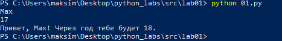


### Задание 2

```
a = float(input().replace(',', '.'))
b = float(input().replace(',', '.'))
sum_ = a + b
avg_ = sum_ / 2
print(f"sum={sum_:.2f}; avg={avg_:.2f}")
```

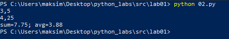


### Задание 3

```
price = int(input())
discount = int(input())
vat = int(input())

base = price * (1 - discount/100)
vat_amount = base * (vat/100)
total = base + vat_amount

print(f"База после скидки: {base:.2f} $")
print(f"Ндс              : {vat_amount:.2f} $")
print(f"Итого к оплате   : {total:.2f} $")
```

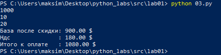


### Задание 4

```
m = int(input())

hours = m // 60
minutes = m % 60

print(f"{hours}:{minutes:02d}")
```

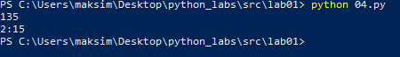


### Задание 5

```
fio_input = input()
fio_new = ' '.join(fio_input.split())

words = fio_new.split()

initials = ''.join([word[0].upper() for word in words])

length = len(fio_new)

print(f"ФИО             : {fio_input}")
print(f"Инициалы        : {initials}.")
print(f"Длина (символов): {length}")
```

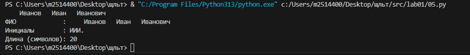


### Задание 6

```
n = int(input())
ochn = 0
zaochn = 0
for i in range(n):
    name = input().split()
    if 'True' in name:
        ochn += 1
    else:
        zaochn += 1
print(ochn, zaochn)
```

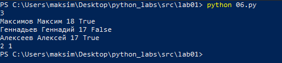


### Задание 7

```
str_ = str(input())

newstr_ = ''
index_first = -1
index_second = -1
index_last = -1

for i in str_:
    index_first += 1
    if i.isupper():
        break

for i in range(len(str_) - 1):
    if str_[i].isdigit():
        index_second = i + 1
        break

for i in str_:
    index_last += 1
    if i == '.':
        break
        

shag = index_second - index_first

for i in range(index_first, index_last + 1, shag):
    newstr_ += str_[i]
print(newstr_)
```

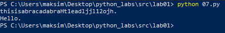


## Лабораторная работа 2

### Задание 1

```
def min_max(a):
    if not a:
        return 'ValueError'

    max_ = -10 ** 10
    min_ = 10 ** 10
    for i in a:
        if i > max_:
            max_ = i
        if i < min_:
            min_ = i

    return (min_, max_)


def unique_sorted(b):
    return sorted(set(b))


def flatten(c):
    if not c:
        return []

    result = []

    for i in c:
        if not isinstance(i, (list, tuple)):
            return 'TypeError'
        result.extend(i)

    return result
```

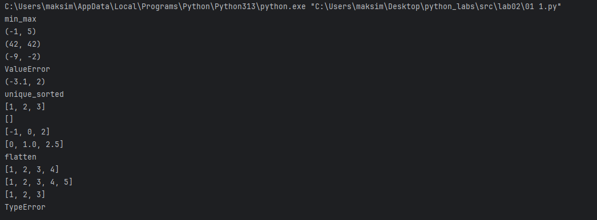


### Задание 2

```
def transpose(a):
    if not a:
        return []

    first_riad = len(a[0])
    for i in a:
        if len(i) != first_riad:
            return 'ValueError'

    result = []
    for stolb in range(len(a[0])):
        new_riad = []
        for riad in range(len(a)):
            new_riad.append(a[riad][stolb])
        result.append(new_riad)

    return result

def row_sums(b):
    if not b:
        return []

    first_riad = len(b[0])
    for i in b:
        if len(i) != first_riad:
            return 'ValueError'

    result = []
    for row in b:
        result.append(sum(row))
    return result

def col_sums(c):
    if not c:
        return []

    first_riad = len(c[0])
    for i in c:
        if len(i) != first_riad:
            return 'ValueError'

    result = []
    for stolb in range(len(c[0])):
        sum_ = 0
        for riad in range(len(c)):
            sum_ += c[riad][stolb]
        result.append(sum_)

    return result
```

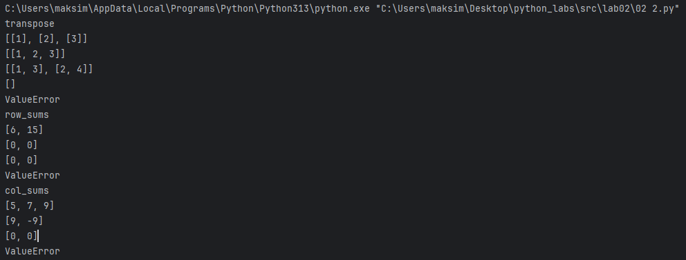


### Задание 3

```
def format_record(rec: tuple[str, str, float]) -> str:
    student, gruppa, gpa = rec
    
    if not isinstance(gpa, (int, float)):
        raise TypeError("GPA должен быть числом")

    if not student or not student.strip():
        raise ValueError("ФИО студента не может быть пустым")

    if not gruppa or not gruppa.strip():
        raise ValueError("Номер группы не может быть пустым")


    student = student.strip().title()
    parts = [part for part in student.split() if part]


    if len(parts) < 1:
        raise ValueError("ФИО должно содержать хотя бы фамилию")

    student = student.title()
    parts = student.split()
    familiya = parts[0]
    new_fam = []
    if len(parts) > 1:
        new_fam.append(parts[1])
    if len(parts) > 2:
        new_fam.append(parts[2])

    initial = []
    for i in new_fam:
        initial.append(i[0] + '.')


    initials_str = ''.join(initial)
    fio = f'{familiya} {initials_str}, гр. {gruppa}, GPA {gpa:.2f}'
    return fio
```

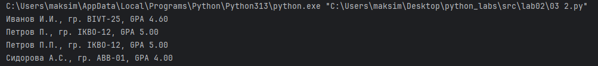

## Лабораторная работа 3

### Задание 1

```
import re
from collections import Counter
from typing import Dict, List, Tuple

def normalize(text: str, *, casefold: bool = True, yo2e: bool = True) -> str:
    if yo2e:
        text = text.replace("ё", "е").replace("Ё", "Е")
    if casefold:
        text = text.casefold()
    text = re.compile(r"[\t\r\n]+").sub(" ", text)
    text = re.compile(r"\s+").sub(" ", text).strip()
    return text

def tokenize(text: str) -> List[str]:
    return re.compile(r"[^\W_]+(?:-[^\W_]+)*", flags=re.UNICODE).findall(text)

def count_freq(tokens: List[str]) -> Dict[str, int]:
    return dict(Counter(tokens))

def top_n(freq: Dict[str, int], n: int = 5) -> List[Tuple[str, int]]:
    if n <= 0:
        return []
    return sorted(freq.items(), key=lambda kv: (-kv[1], kv[0]))[:n]
```

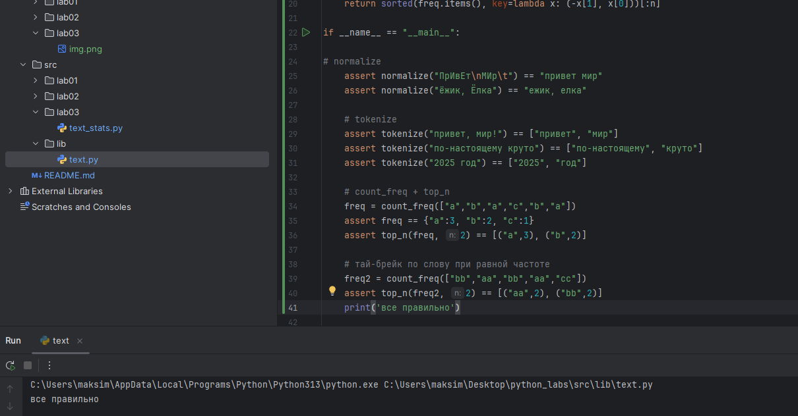

### Задание 2

```
from __future__ import annotations

import sys
from pathlib import Path

sys.path.append(str(Path(__file__).resolve().parents[1]))

from lib.text import normalize, tokenize, count_freq, top_n


def main() -> None:
    data = sys.stdin.read()

    norm = normalize(data)
    tokens = tokenize(norm)
    freq = count_freq(tokens)
    top = top_n(freq, n=5)

    print(f"Всего слов: {len(tokens)}")
    print(f"Уникальных слов: {len(freq)}")
    print("Топ-5:")
    for word, cnt in top:
        print(f"{word}:{cnt}")


if __name__ == "__main__":
    main()
```

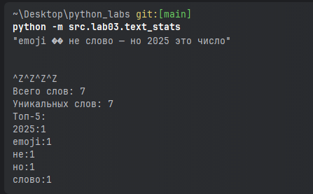

## Лабораторная работа 4

### Задание 1

```
from pathlib import Path
import csv
from typing import Iterable, Sequence

def read_text(path: str | Path, encoding: str = "utf-8") -> str:
    """Считывает текст из .txt файла"""
    p = Path(path)
    if p.suffix.lower() != ".txt":
        raise ValueError("Неправильный формат — требуется файл с расширением txt.")
    try:
        return p.read_text(encoding=encoding)
    except FileNotFoundError:
        raise FileNotFoundError(f"Файл не найден: {p}")
    except UnicodeDecodeError:
        raise UnicodeDecodeError("Ошибка декодирования. Попробуйте другую кодировку.")


def write_csv(rows: list[tuple | list], path: str | Path, header: tuple[str, ...] | None = None) -> None:
    p = Path(path)
    if p.suffix.lower() != ".csv":
        raise ValueError("Неправильный формат — требуется файл с расширением .csv")

    rows = list(rows)
    if rows:
        length = len(rows[0])
        for r in rows:
            if len(r) != length:
                raise ValueError("Все строки должны иметь одинаковую длину")

    if header is not None and rows:
        if len(header) != len(rows[0]):
            raise ValueError("Длина заголовка не совпадает с длиной строк данных")

    with p.open("w", newline="", encoding="utf-8") as f:
        w = csv.writer(f)
        if header is not None:
            w.writerow(header)
        for r in rows:
            w.writerow(r)

# Тестовые задания

if __name__ == "__main__":
    # Задание A
    Path("data").mkdir(exist_ok=True)
    (Path("data") / "input.txt").write_text("Привет, мир! Привет!!!", encoding="utf-8")
    print("Файл data/input.txt создан")

    # Задание B
    def print_csv(path):
        p = Path(path)
        with p.open('r', encoding='utf-8') as f:
            for line in f:
                print(line.strip())

    write_csv([], "data/empty.csv", header=("a", "b"))
    print_csv("data/empty.csv")

    write_csv([("word", "count"), ("test", 3)], "data/check.csv")
    print_csv("data/check.csv")

    txt = read_text(Path("data") / "input.txt")
    print("Содержимое input.txt:", txt)
    csv_path = Path("data") / "report.csv"
    write_csv([("word", "count"), ("привет", 2)], csv_path, header=("word", "count"))
    print("Создан CSV:", csv_path)

    try:
        (Path("data") / "1251input.txt").write_text("Привет из cp1251", encoding="cp1251")
        str_cp1251 = read_text("data/1251input.txt", encoding='cp1251')
        print("Прочитано из cp1251:", str_cp1251)
    except Exception as e:
        print("Ошибка при чтении cp1251 файла:", e)
```


### При больших файлах читаем построчно, не переделывая все строки в список

```
def write_csv(rows: list[tuple | list], path: str | Path, header: tuple[str, ...] | None = None) -> None:
    p = Path(path)
    if p.suffix.lower() != ".csv":
        raise ValueError("Неправильный формат — требуется файл с расширением .csv")

    rows = list(rows)
    if rows:
        length = len(rows[0])
        for r in rows:
            if len(r) != length:
                raise ValueError("Все строки должны иметь одинаковую длину")

    if header is not None and rows:
        if len(header) != len(rows[0]):
            raise ValueError("Длина заголовка не совпадает с длиной строк данных")

    with p.open("w", newline="", encoding="utf-8") as f:
        w = csv.writer(f)
        if header is not None:
            w.writerow(header)
        for r in rows:
            w.writerow(r)
```
### Создание папки data и файла input.txt
```
from pathlib import Path
Path("data").mkdir(exist_ok=True)
Path("data")/ "input.txt".write_text("Привет, мир! Привет!!!", encoding="utf-8")
csv_path = Path("data") / "check.csv"
write_csv([("word", "count"), ("test", 3)], csv_path)
print(csv_path)

```
### Чтение кодировки 1251
```
    try:
        (Path("data") / "1251input.txt").write_text("Привет из cp1251", encoding="cp1251")
        str_cp1251 = read_text("data/1251input.txt", encoding='cp1251')
        print("Прочитано из cp1251:", str_cp1251)
    except Exception as e:
        print("Ошибка при чтении cp1251 файла:", e)
```
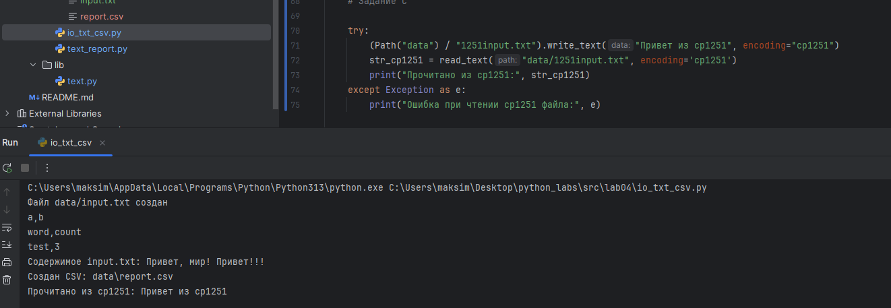

### Чтение пустого файла
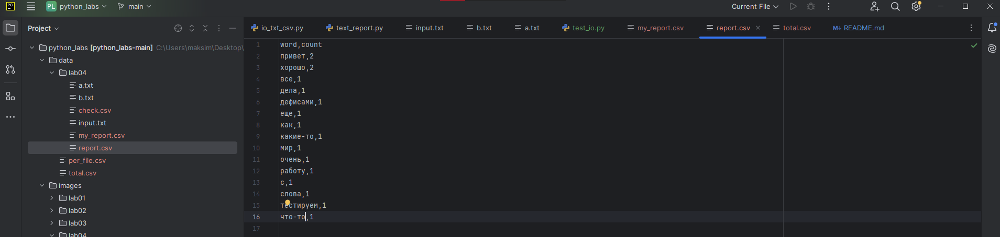

### Чтение текста в другой кодировке


### Чтение текста в другом формате
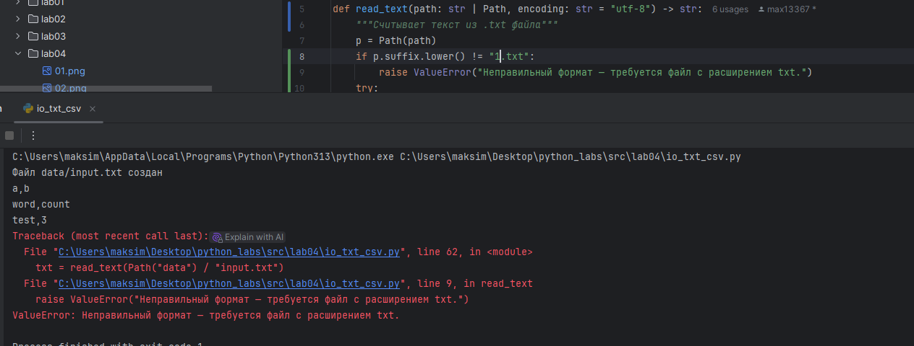

### Задание 2
```
from pathlib import Path
from collections import Counter
from src.lib.text import normalize, tokenize, top_n
from src.lab04.io_txt_csv import read_text, write_csv


try:
    text = read_text(Path("data/input.txt"))
except FileNotFoundError:
    print(f"Файл не найден: {Path("data/input.txt")}")
    raise
except UnicodeDecodeError:
    print(f"Ошибка кодировки при чтении файла: {Path("data/input.txt")}")
    raise

def frequencies_from_text(text: str) -> dict[str, int]:
    from src.lib.text import normalize, tokenize, top_n # из ЛР3
    tokens = tokenize(normalize(text))
    return Counter(tokens) # dict-like

def sorted_word_counts(freq: dict[str, int]) -> list[tuple[str, int]]:
    return sorted(freq.items(), key=lambda kv: (-kv[1], kv[0]))

text=sorted_word_counts(frequencies_from_text(read_text("data/input.txt")))
write_csv(text, "data/report.csv", header=("word", "count"))

tekst = read_text("data/input.txt")
tokens = (tokenize(normalize(tekst)))
count=Counter(tokens)
sorted_freq = sorted_word_counts(count)

print(f"Всего слов: {len(tokens)}")
print(f"Уникальных слов: {len(count)}")
print(f"Топ-5:")
for word, col in sorted_freq[:5]:
    print(f"{word}:{col}")
```
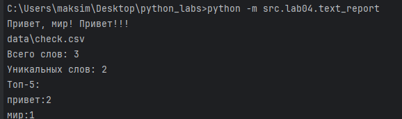
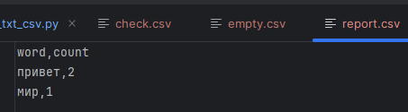

## Лабораторная работа 5

### Задание 1

```
from pathlib import Path
import json
import csv

def json_to_csv(json_path: str, csv_path: str) -> None:
    p_json = Path(json_path)
    p_csv = Path(csv_path)

    if p_json.suffix.lower() != ".json":
        raise ValueError("Ожидается файл с расширением .json")
    if p_csv.suffix.lower() != ".csv":
        raise ValueError("Ожидается файл с расширением .csv")

    if not p_json.exists():
        raise FileNotFoundError("Файл JSON не найден")

    if not p_csv.parent.exists():
        raise FileNotFoundError(f"Директория для CSV не найдена")

    try:
        data = json.loads(p_json.read_text(encoding="utf-8"))
    except json.JSONDecodeError:
        raise ValueError("Ошибка чтения JSON")

    if not data or not isinstance(data, list):
        raise ValueError("Пустой JSON")
    if not all(isinstance(item, dict) for item in data):
        raise ValueError("JSON должен содержать список словарей")

    # Определяем все возможные ключи
    keys = list(data[0].keys())
    for d in data[1:]:
        for k in d.keys():
            if k not in keys:
                keys.append(k)

    # Запись CSV
    with p_csv.open("w", newline="", encoding="utf-8") as f:
        writer = csv.DictWriter(f, fieldnames=keys)
        writer.writeheader()
        for row in data:
            writer.writerow({k: row.get(k, "") for k in keys})

    with p_csv.open("r", encoding="utf-8", newline="") as f:
        reader = csv.DictReader(f)
        csv_data = list(reader)
        if len(csv_data) != len(data):
            raise ValueError("Количество записей не совпадает после конвертации")


def csv_to_json(csv_path: str, json_path: str) -> None:
    p_csv = Path(csv_path)
    p_json = Path(json_path)

    if p_csv.suffix.lower() != ".csv":
        raise ValueError("Ожидается файл с расширением .csv")
    if p_json.suffix.lower() != ".json":
        raise ValueError("Ожидается файл с расширением .json")

    if not p_csv.exists():
        raise FileNotFoundError("Файл CSV не найден")

    if not p_json.parent.exists():
        raise FileNotFoundError(f"Директория для JSON не найдена")

    # Чтение CSV
    with p_csv.open("r", encoding="utf-8", newline="") as f:
        reader = csv.DictReader(f)
        if not reader.fieldnames:
            raise ValueError("CSV должен содержать заголовок")
        data = [row for row in reader]

    if not data:
        raise ValueError("CSV пустой")

    # Запись JSON
    with p_json.open("w", encoding="utf-8") as f:
        json.dump(data, f, ensure_ascii=False, indent=2)

    reread = json.loads(p_json.read_text(encoding="utf-8"))
    if len(reread) != len(data):
        raise ValueError("Количество записей не совпадает после конвертации")
```
### Ошибки 
#### Пустой json
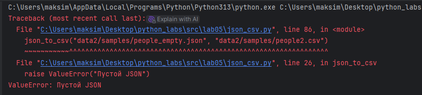
#### Другое расширение(не json)
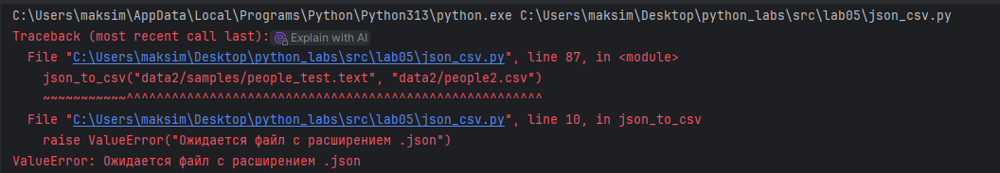
#### Нету файла json
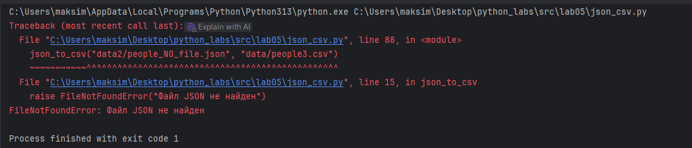
#### Другое расширение(не csv)
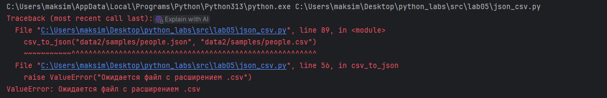
#### Нету загаловка csv
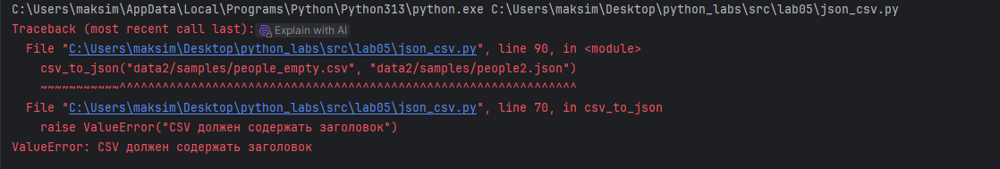
#### Нету файла csv
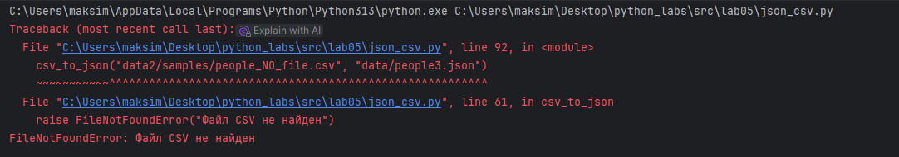
#### json не содержит список словарей
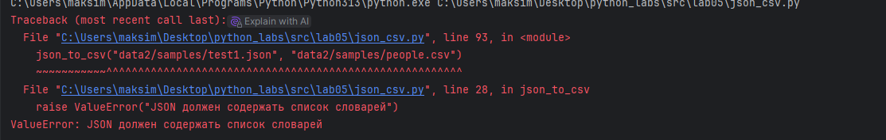

### Задание 2

```
from pathlib import Path
import csv
from openpyxl import Workbook

def csv_to_xlsx(csv_path: str, xlsx_path: str) -> None:
    p_csv = Path(csv_path)
    p_xlsx = Path(xlsx_path)
    # Проверки путей
    if p_csv.suffix.lower() != ".csv":
        raise ValueError("Ожидается файл с расширением .csv")
    if p_xlsx.suffix.lower() != ".xlsx":
        raise ValueError("Ожидается файл с расширением .xlsx")

    if not p_csv.exists():
        raise FileNotFoundError("Файл CSV не найден")

    # Чтение CSV
    with p_csv.open("r", encoding="utf-8", newline="") as f:
        reader = csv.reader(f)
        rows = list(reader)

    # Проверка содержимого
    if not rows or all(not any(row) for row in rows):
        raise ValueError("Пустой CSV или неподдерживаемая структура")

    # Создание XLS
    wb = Workbook()
    ws = wb.active
    ws.title = "Sheet1"

    for row in rows:
        ws.append(row)

    # Автоширина
    for col in ws.columns:
        max_len = max(len(str(cell.value or "")) for cell in col)
        col_letter = col[0].column_letter
        ws.column_dimensions[col_letter].width = max(max_len + 2, 8)

    # Проверка директории назначения
    if not p_xlsx.parent.exists():
        raise FileNotFoundError(f"Директория для XLSX не найдена")

    # Сохранение
    wb.save(p_xlsx)
#ПРИМЕР
    # Конвертация people.csv → people.xlsx
csv_to_xlsx("data2/samples/people.csv", "data2/out/people1.xlsx")

csv_input = Path("data2/samples/cities.csv")
xlsx_output = Path("data2/out/cities.xlsx")

# Создаём папку out, если её нет
xlsx_output.parent.mkdir(parents=True, exist_ok=True)
csv_input.parent.mkdir(parents=True, exist_ok=True)

# Записываем пример в CSV
example_rows = [
    ["city", "country", "language"],
    ["Moscow", "Russia", "Russian"],
    ["Tokyo", "Japan", "Japanese"],
    ["Paris", "France", "French"],
]
with csv_input.open("w", newline="", encoding="utf-8") as f:
    writer = csv.writer(f)
    writer.writerows(example_rows)

# Конвертация CSV → XLSX
csv_to_xlsx(csv_input, xlsx_output)

csv_to_xlsx("data2/samples/people_empty.csv", "data2/samples/people2.xlsx")
#csv_to_xlsx("data2/samples/people_NO_file.csv", "data/samples/people3.xlsx")
#csv_to_xlsx("data2/samples/tupy.csv", "data/samples/people3.json")

```
### Ошибки 
#### Пустой csv
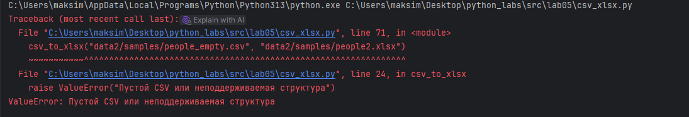
#### Нету файла csv
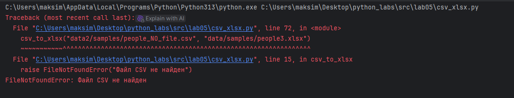
#### Другое расширение(не xlsx)
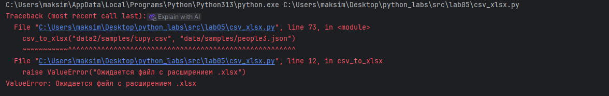

### Пример работы json_csv
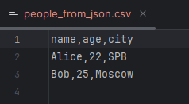
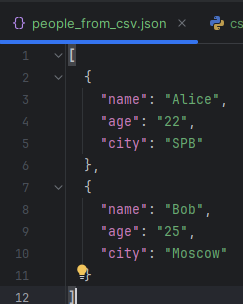

### Пример работы csv_xlsx
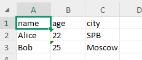
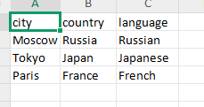

